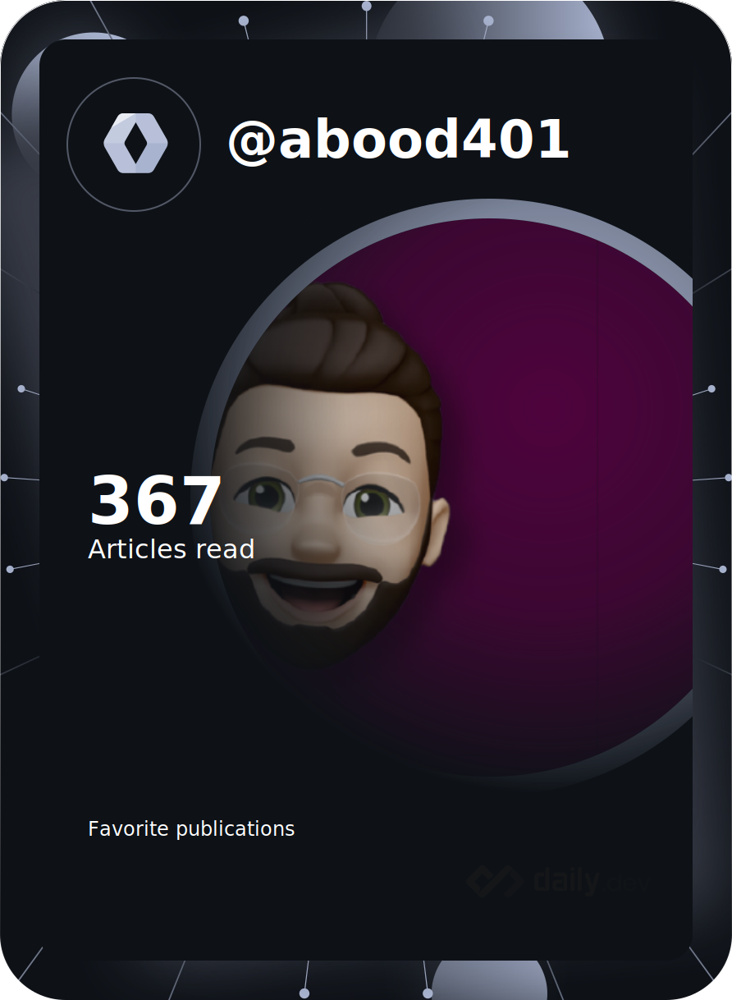

                                                               👋 Hi, I’m Abood
                                                               
- 👀 Passionate about Tech & Development
- 🌱 I’m currently learning Flutter & Dart
- 💡Looking to contribute in open source projects
- ➡️ Any project ideas i may come handy -> <a href="mailto:sayyedabood69@gmail.com?">Mail ME</a>
- 📫 Know more about me <a href="https://dev.page/abood?utm_source=dev.page&utm_medium=site&utm_campaign=share-dialog">On Dev Page.</a>
- 👉🏼👈🏼 Wanna Buy me a coffe <a href="https://www.buymeacoffee.com/AbdulRaheem">here</a>

    

<!---
Abood2284/Abood2284 is a ✨ special ✨ repository because its `README.md` (this file) appears on your GitHub profile.
You can click the Preview link to take a look at your changes.
--->
